# DeliveryApp
## __Technologies__

* [Used API](https://pokeapi.co/docs/v2)
* [Kotlin](https://kotlinlang.org/)
* [Retrofit](https://square.github.io/retrofit/)
* [LiveData](https://developer.android.com/topic/libraries/architecture/livedata)
* [ViewModel](https://developer.android.com/topic/libraries/architecture/viewmodel)
* [Kotlin Coroutines](https://developer.android.com/kotlin/coroutines)
* [Themes](https://developer.android.com/develop/ui/views/theming/themes)
* [Notification](https://developer.android.com/develop/ui/views/notifications/build-notification)
* [MultiLanguage](https://developer.android.com/training/basics/supporting-devices/languages)
* [ViewBindingPropertyDelegate](https://github.com/androidbroadcast/ViewBindingPropertyDelegate)
* [Hilt](https://developer.android.com/training/dependency-injection/hilt-android)
* [SharedPreferences](https://developer.android.com/training/data-storage/shared-preferences)
* [safeargs](https://developer.android.com/guide/navigation/use-graph/pass-data)
* [Mlkit barcode](https://developers.google.com/ml-kit/vision/barcode-scanning)
* [Splashscreen](https://developer.android.com/develop/ui/views/launch/splash-screen)
* [Material 3](https://m3.material.io/)
* [Coil](https://coil-kt.github.io/coil/getting_started/)
* [Camerax](https://developer.android.com/training/camerax)
* [Compose](https://developer.android.com/jetpack/compose)
* [Compose navigation](https://developer.android.com/jetpack/compose/navigation)
* [firebase messaging](https://firebase.google.com/docs/cloud-messaging/android/client)

## __Screenshots__

  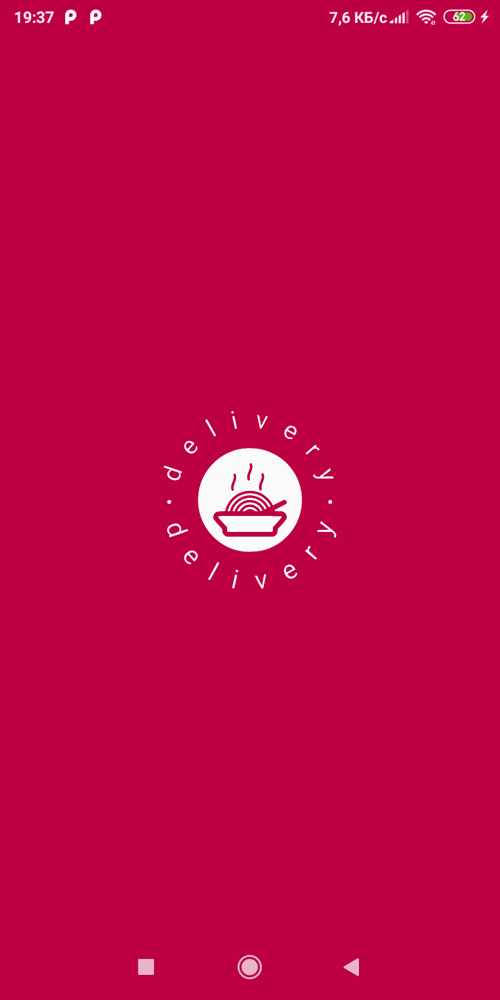
  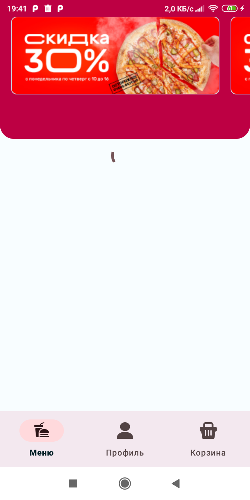
  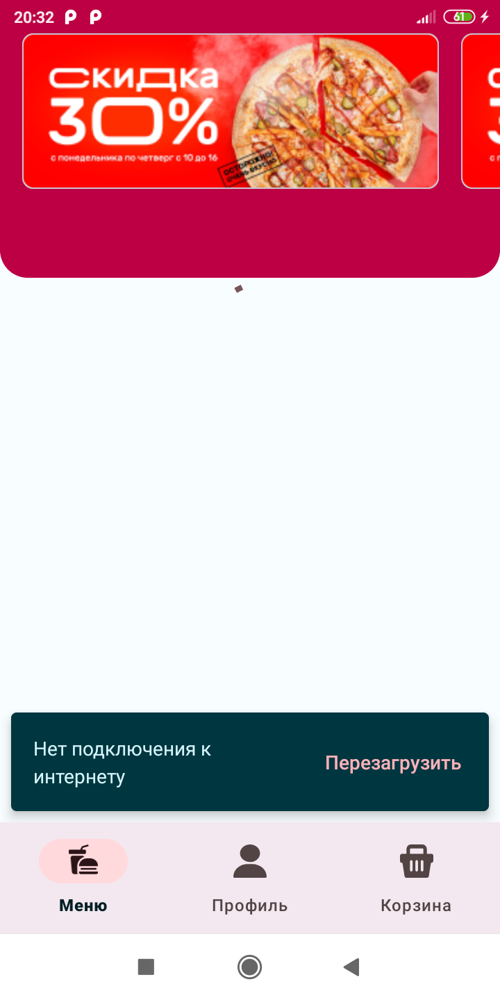
  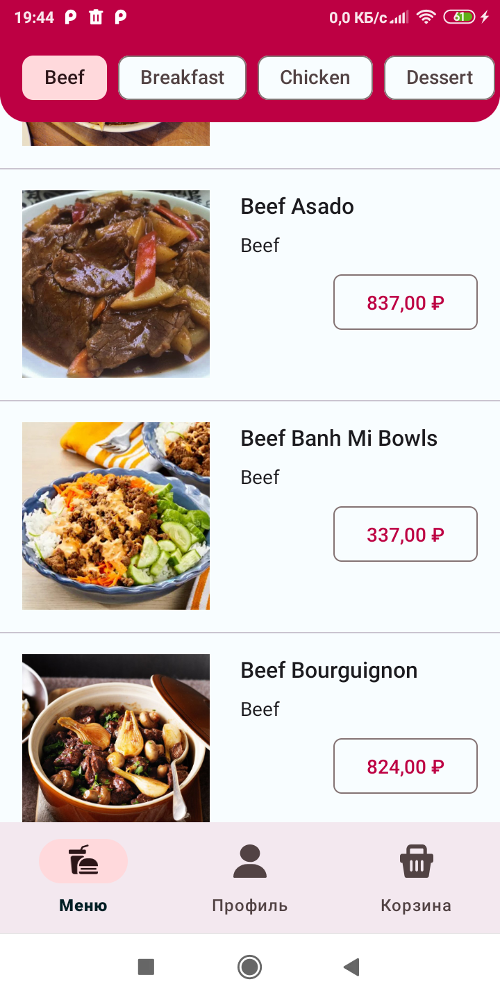
  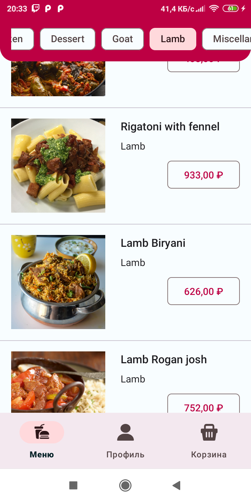
  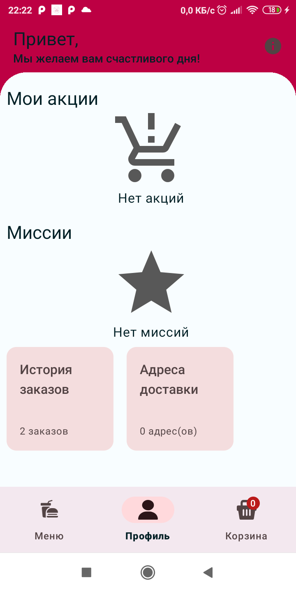
  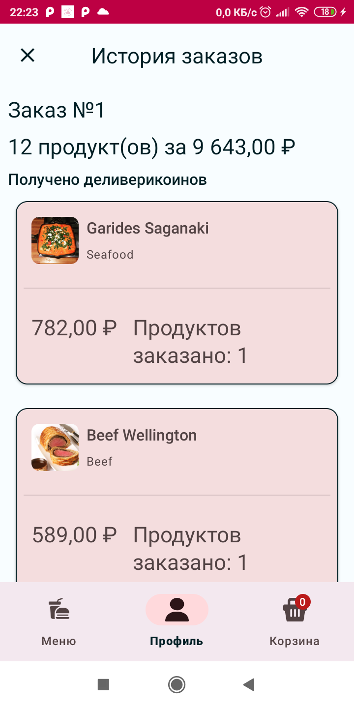
  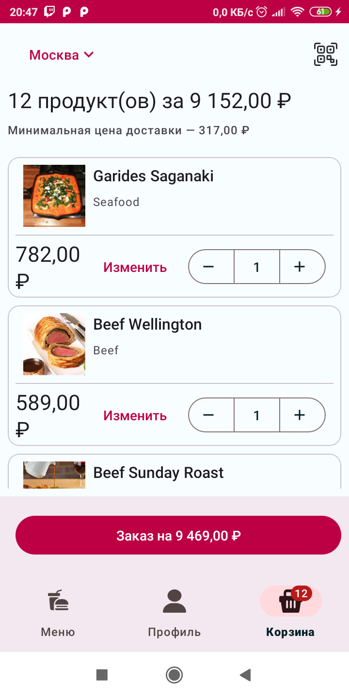
  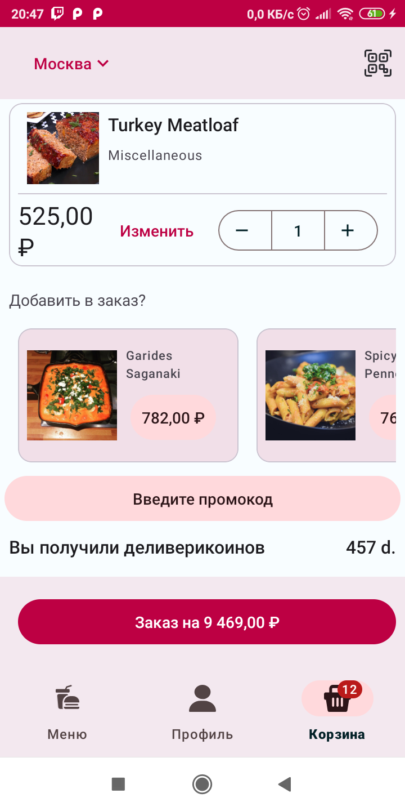
  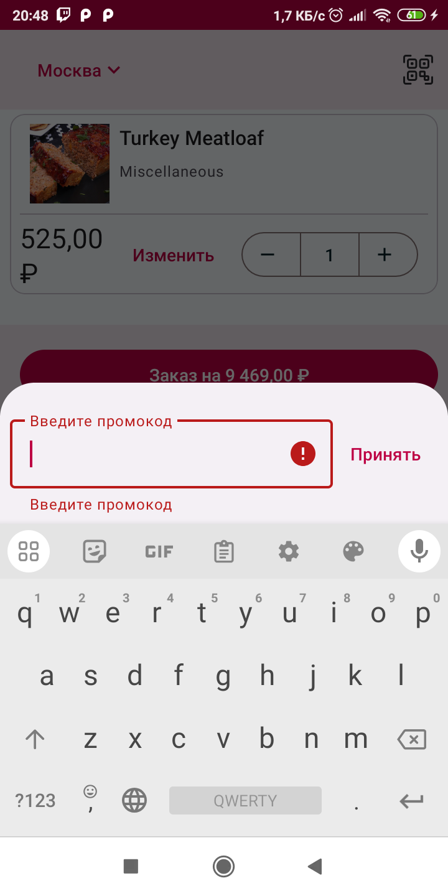
  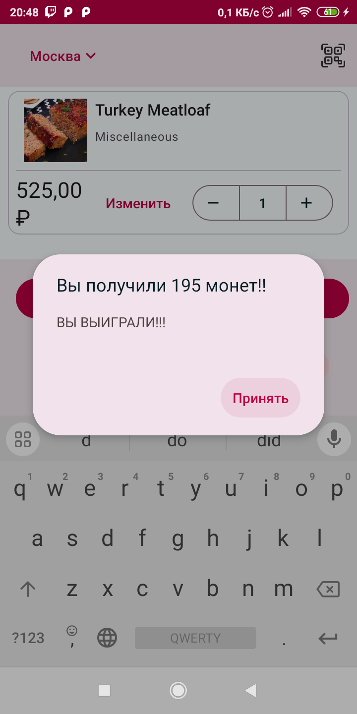
  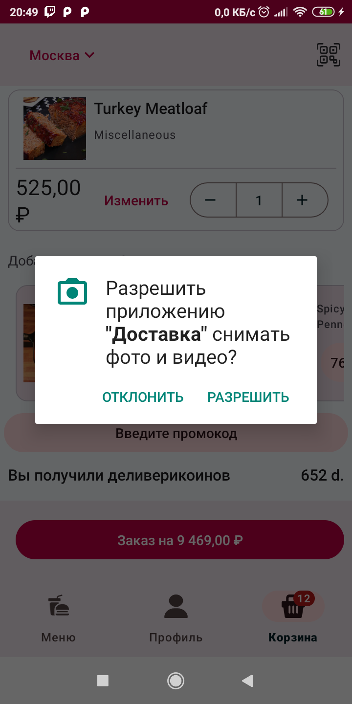
  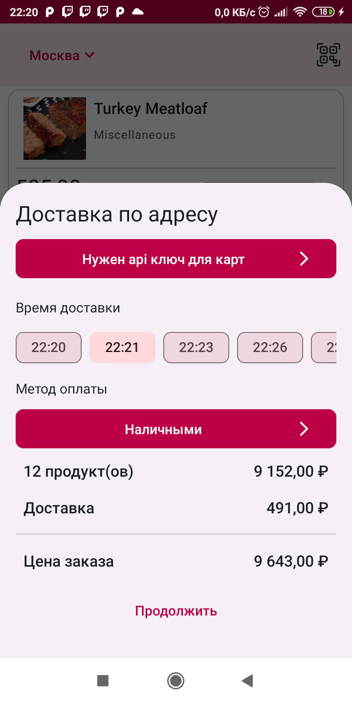
  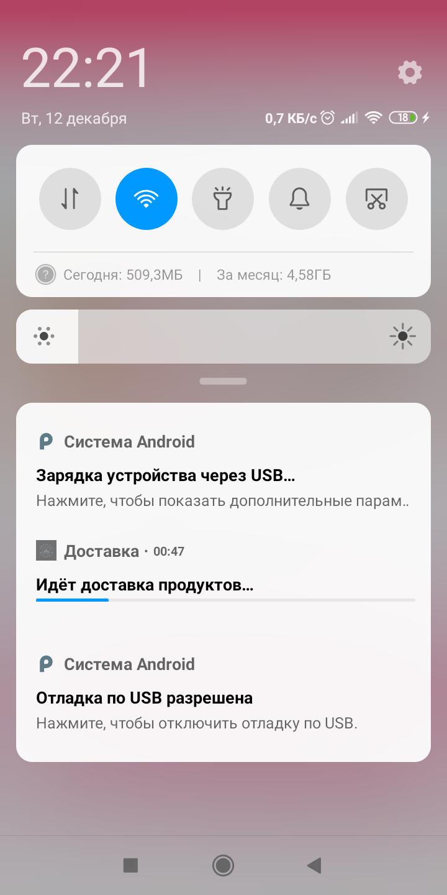
  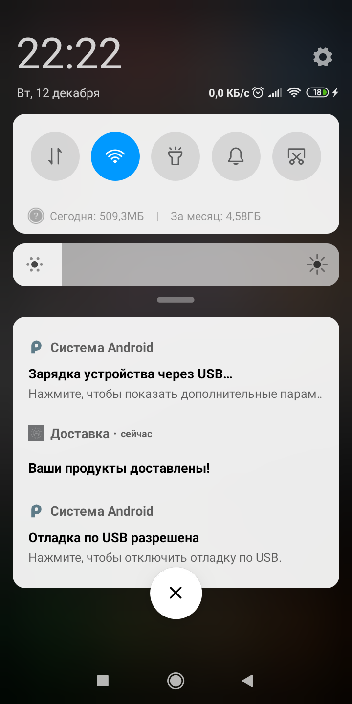

  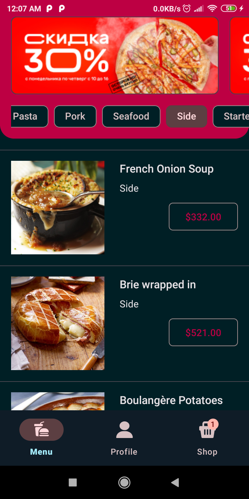
  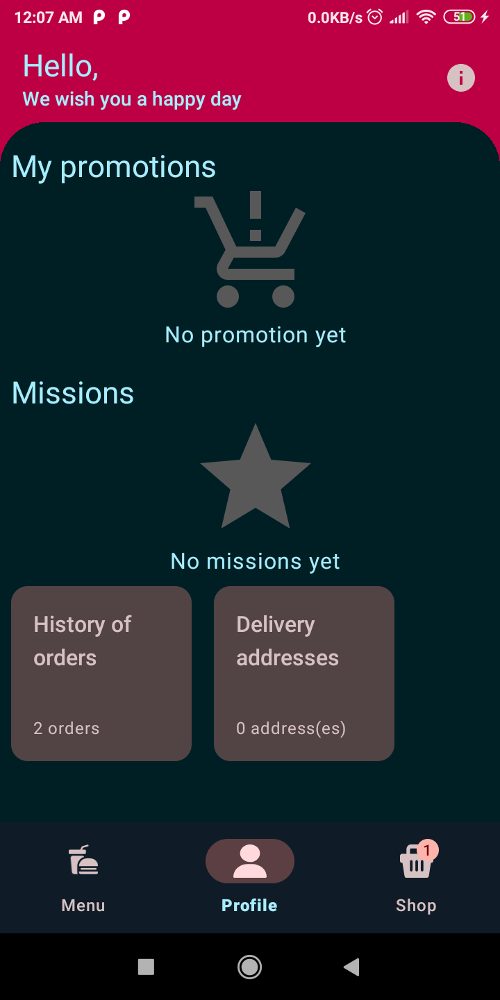
  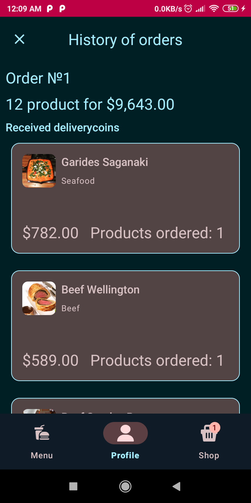
  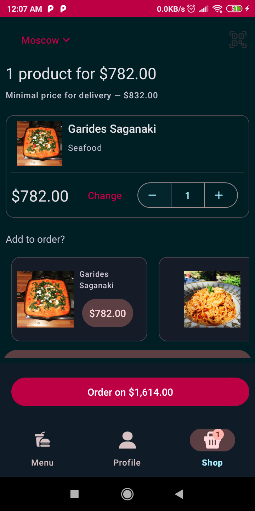

